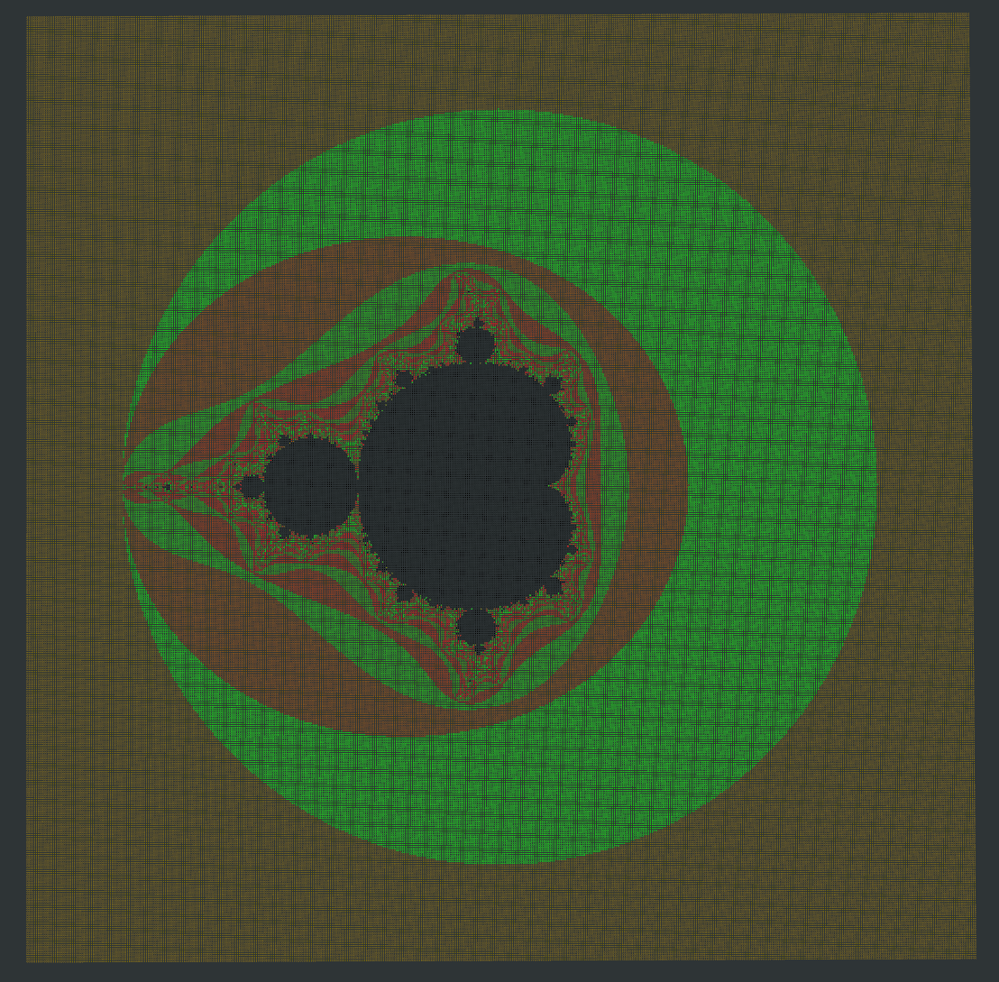
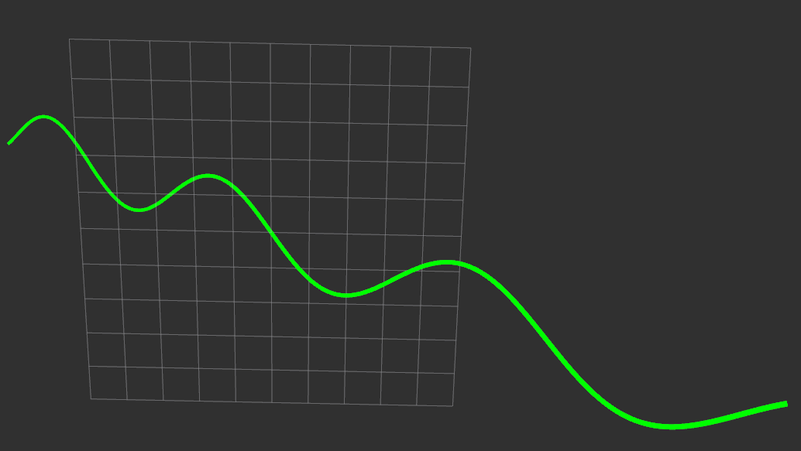
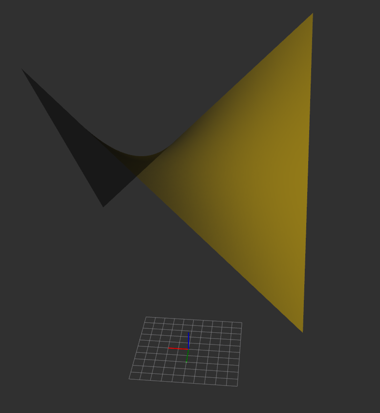
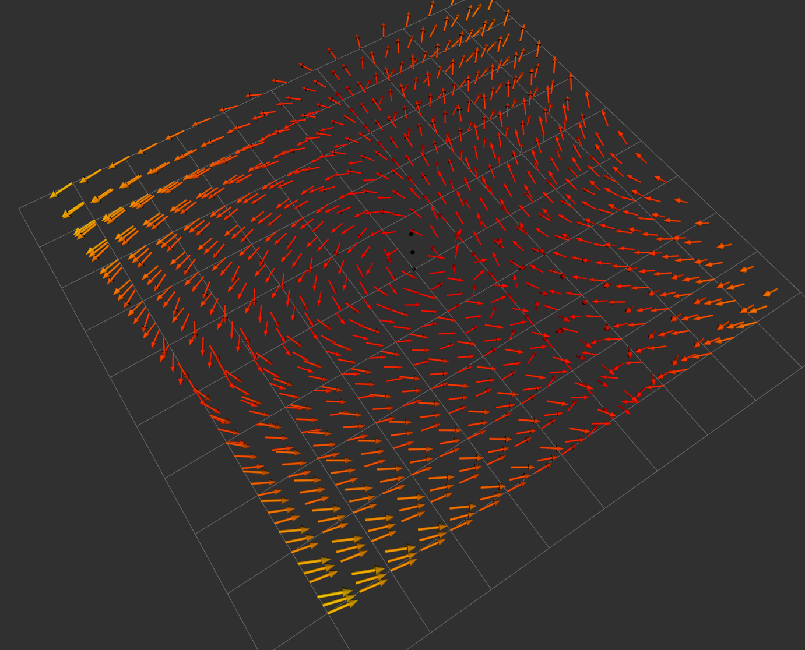
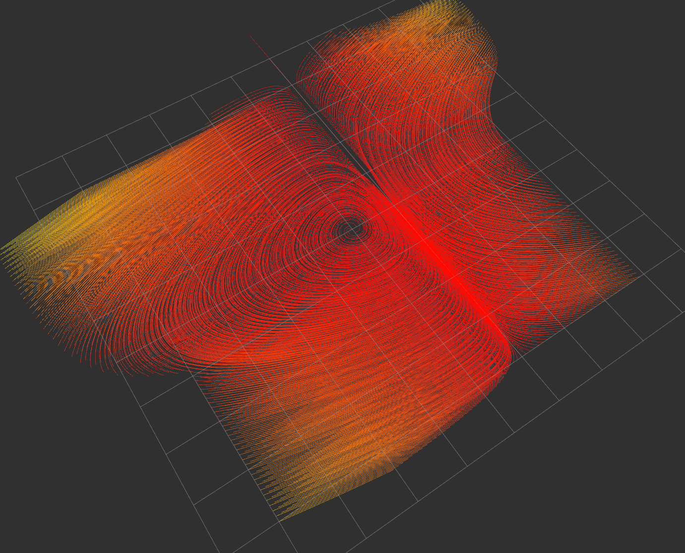

这个文档只介绍可视化的API，与LiTouch交互的API在LiTouch文档中。
### 1. 基础组件绘制API
---

可使用的API包括：

-- drawOnePoint  `         绘制一个点`  
-- drawPoints  `         绘制若干个点`  
-- drawOneSphere  `         绘制一个球体`  
-- drawOneCylinder  `         绘制圆柱体`  
-- drawOneCube  `         绘制立方体`  
-- drawOneArrow  `         绘制箭头`  
-- drawArrows  `         绘制一组箭头`  
-- drawArrowsWithColors  `         绘制一组具有不同颜色的箭头`  
-- drawLineStrip  `         绘制一条折线`  
-- drawLineList  `         绘制线段集`  
-- drawLineListWithColors  `         绘制具有不同颜色的线段集`  
-- draw2DPolygon  `         绘制一个2D多边形`  
-- draw2DRect  `         绘制一个2D矩形`  
-- draw2DCircle  `         绘制一个2D圆`  
-- draw2DEllipse  `         绘制一个2D椭圆`  
-- draw2DCone`         绘制一个2D圆锥`  
-- drawViewText `         绘制始终朝向视口的文字`  
-- renderTriangleMesh `         绘制三角网格体`  
-- renderTriangleMeshEdges `         绘制三角网格体边棱`    
-- drawPointcloud `         绘制点云`   
-- drawPointcloudRGB `         绘制彩色点云`   
-- drawPointcloudI `         绘制带强度信息点云` 

上述API的调用可参考API文档注释，或演示程序。  

---
### 2. 部分自定义组件绘制API

-- drawPointcloudWithShader  `绘制自定义着色点云`   

使用自定义着色器函数进行点云着色，着色器函数类型如下，支持lambda表达式、函数和成员函数。
```C++
typedef std::function<Eigen::Vector3d(const Eigen::Vector3d)> ShaderFunction;
```
示例：
```C++
Eigen::Vector3d mandelbrotShader(const Eigen::Vector3d pos) {
  std::complex<double> c( (pos[0] - 6)/2, (pos[1] + 6)/2);
  std::complex<double> z(0, 0);
  int max_iterations = 100;
  int iteration = 0;
  while (std::abs(z) <= 2.0 && iteration < max_iterations) {
    z = z * z + c;
    iteration++;
  }
  if (iteration == max_iterations) {
    return Eigen::Vector3d(0, 0, 0); // 黑色，表示在曼德尔布罗特集合内
  } else {
    // 根据发散速度返回颜色
    double ratio = double(iteration) / max_iterations;
    return Eigen::Vector3d(255 * ratio, 255 * (1 - ratio), 0);
  }
}

void demo(){
    // 点云定义...
    // 使用自定义着色器绘制点云
    Livz::drawPointcloudWithShader("shader_pointcloud", cloud, mandelbrotShader);    
}
```
这将采用曼德勃罗集合染色函数来染色点云：  


-- drawParametricCurve  `绘制参数化曲线`  

绘制自定义参数化三维曲线，其定义如下：
```C++
typedef std::function<Eigen::Vector3d(const double)> ParametricCurveFunction;
```

示例：
```C++
// 绘制参数化曲线,这次使用lambda表达式表示函数
auto curveFunction = [](double t) -> Eigen::Vector3d {
    return Eigen::Vector3d(t, std::sin(t), t);
};
Livz::drawParametricCurve("parametric_curve", curveFunction, Eigen::Vector2d(-10, 10), LCOLOR::GREEN);
```



-- renderSurface  `绘制参数化曲面（二元函数）`  

绘制自定义参数化曲面，其定义如下：
```C++
typedef std::function<double(const double, const double )> ParametricSurfaceFunction;
```

示例：
```C++
class A{
public:
  double surf_func(double u, double v) { 
    double z = 0.1 *u * v; // 马鞍曲面
    return z + 20;
  }
  void run_demo(){
    // 绘制参数化曲面， 这次使用成员函数， 可以用提供的宏生成捕获this指针的lambda表达式。
    Livz::renderSurface("surf", SURFFUNC_FROM_MEMBER(surf_func), Eigen::Vector2d(-10, 10), Eigen::Vector2d(-10, 10), 0.1, 0.1, LCOLOR::GOLD, 0.5, "map", 1);
    // 或者
    // Livz::renderSurface("surf", [this](double u, double v)->double{ return this->surf_func(u,v);},
    // Eigen::Vector2d(-10, 10), Eigen::Vector2d(-10, 10), 0.1, 0.1, LCOLOR::GOLD, 0.5, "map", 1);
  }
};
void outside_class() {
  A a;
  // 如果在类外，就只好用lambda包装一下了
  auto func = [a](double u, double v)->double{ return a.surf_func(u,v);} ; 
  Livz::renderSurface("surf", func, Eigen::Vector2d(-10, 10), Eigen::Vector2d(-10, 10), 0.1, 0.1, LCOLOR::GOLD, 0.5, "map", 1);
}
```


### 3. 非线性动画
---
Livz 中，可以快捷地生成相同话题下相同类型可视化的非线性插值动画，只需要使用下面这个API：

-- createAnimate `创建一个动画任务`  

所需要的参数为：  
-- LAnimateParam ani_param `动画参数`  
-- Func func `执行函数`  
-- Params params_begin `初状态参数`  
-- Params params_end `末状态参数`  

LAnimateParam 类包含四个参数：

-- topic_name_ `话题名称`  
-- duration_   `动画持续时间`  
-- rate_func_  `插值函数`  
-- loop_     `是否循环`

以下为一个示例，演示了从一个点云过渡变化到另一个点云：

```C++
  // 创建2个点云对象
  pcl::PointCloud<pcl::PointXYZ> cloud1;
  pcl::PointCloud<pcl::PointXYZ> cloud2;
  // 填充矩形区域的点云数据
  for (float x = -2; x < 2; x += 0.01) {
      for (float y = -2; y < 2; y += 0.01) {
          pcl::PointXYZ point;
          point.x = 3*x;
          point.y = 3*y;
          point.z = x*x + y*y;
          cloud1.points.push_back(point);
          point.x = x;
          point.y = y;
          point.z = 5-x*x-y*y;
          cloud2.points.push_back(point);
      }
  }
  // 话题名 pointcloud ， 持续时间4秒，线性插值函数，不循环。
  LAnimateParam ani_param("pointcloud", 4.0, RATE_FUNC::linear, false);
  // 用 LPARAMS 打包  Livz::drawPointcloud 所需的参数
  Livz::createAnimate(ani_param, Livz::drawPointcloud, 
                      LPARAMS(cloud1     , LCOLOR::CYAN,     "map") , 
                      LPARAMS(cloud2     , LCOLOR::ORANGE,   "map") );
```


执行函数的两组参数需要使用LPARAMS打包，并且有几点需要注意：

1. 参数不包含话题名称，话题名称在LAnimateParam对象中设置
2. 不能使用缺省参数，必须给出所有参数
3. 类型必须严格，例如函数需要double参数，必须写成 1.0 而不是 1

Func执行函数支持Livz的所有API。

### 4. 自定义 Updater
---
Livz中，使用 addUpdater 可以添加自定义 updater function。该函数定义如下：

```C++
typedef std::function<bool( ... )> UpdaterFunction;
```
即需要返回bool，且无参数限制。

执行addUpdater后，添加的 updater function 将在每一帧被调用，直到 updater function 返回true或者使用 removeUpdater 移除。

-- addUpdater   `添加 updater function 任务`   
-- removeUpdater   `移除 updater function 任务`

以下是一个示例，演示了让一个小球沿着轨迹运动10秒：

```C++
Eigen::Vector3d sin3D(double t){
     return Eigen::Vector3d(t, std::sin(t), t);
}

bool moveBallUpdater(double duration){
    // duration表示自创建任务开始，经过的秒数
    Livz::drawOneSphere("sphere", sin3D(duration), 0.7, LCOLOR::YELLOW, -1.0, "map",1);

  // 10 秒后销毁任务
    if(duration > 10.0){ 
        Livz::clearAll("sphere");
        return true; //这将结束任务，自动删除此updater
    } 
    return false;
}
// 新建任务，命名为 task1
Livz::addUpdater("task1", moveBallUpdater);
Livz::Delay( 5000 );
// 5秒后删除task1, 因此moveBallUpdater执行不到第10秒
Livz::removeUpdater("task1");
```


### 5. 向量场可视化
---
Livz提供两种三维向量场的可视化方法： 梯度箭头和流线。

首先，三维向量场的定义如下：
```C++
typedef std::function<Eigen::Vector3d(Eigen::Vector3d)> vectorFieldFunction
```

-- renderVectorField `用梯度箭头的方法可视化向量场`  
-- renderStreamLines `用流线的方法可视化向量场`

更加推荐用 renderStreamLines 可视化向量场，因为Marker 没有提供ARROW_LIST类型，因此绘制大量箭头需要频繁地向GPU传输顶点信息，开销很大。

两个API中，only_2d 参数可以设置为true, 这样将会只绘制二维向量场，第三个维度将被忽略。

以下是两种方法的示例：

```C++
// 经典大漩涡
Eigen::Vector3d field(Eigen::Vector3d pos){
    double x = pos.x();
    double y = pos.y();
    double z = pos.z();

    Eigen::Vector3d originalComponent(x * y, y * z, z * x);
    Eigen::Vector3d vortexCenter(0, 0, 0);
    Eigen::Vector3d relativePos = pos - vortexCenter;

    double vortexStrength           = 1.0;
    Eigen::Vector3d vortexComponent = vortexStrength * Eigen::Vector3d(-relativePos.y(), relativePos.x(), 0);
    Eigen::Vector3d result          = originalComponent + vortexComponent;

    return result;
}
// 用箭头绘制三维漩涡场
Livz::renderVectorField("field", field, Eigen::Vector3d(-4,-4,0), Eigen::Vector3d(4,4,1), Eigen::Vector3d(0.5,0.5,0.5),false);
Livz::Delay(2000);
Livz::clearAll("field");
// 改用流线绘制，但是这次只绘制二维
Livz::renderStreamLines("streamline", field, Eigen::Vector3d(-4,-4,0), Eigen::Vector3d(4,4,1), Eigen::Vector3d(0.1,0.1,0.1), 0 ,19 , true);
```


